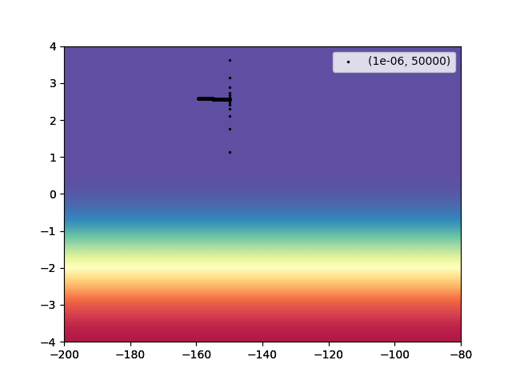
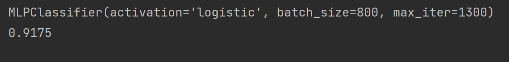
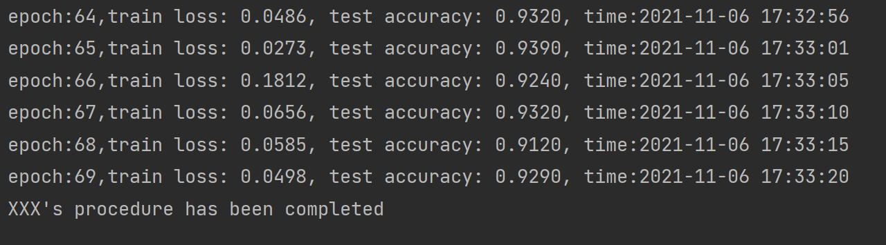

**本次作业主要有三个任务：**

1. 实现梯度下降算法和Adagrad算法，完成GD.py和Adagrad.py的填空，并提交：

梯度下降算法  学习率：0.0000001，迭代次数：100000；学习率：0.000001，迭代次数：100000；学习率：0.000001 迭代次数：500000 的绘图结果

Adagrad算法  学习率：1，迭代次数：10000  的绘图结果

共4张数据图，图像横轴为b的值，纵轴为w的值，绘图结果参照：

2. 实现采用MLP模型对mnist数据集进行分类，完成MLP_mnist.py的填空，并提交运行截图，如下图所示：

3. 实现采用CNN模型对mnist数据集进行分类，完成cnn_mnist.py的填空，并提交运行截图，如下图所示,其中的“XXX”需要改为学生自己的姓名。

这三个任务，我们都会给出基础代码框架，并添加详细的注释。同学们需要理解框架，然后进行填空式编程，最终提交运行结果并回答开放性问题。

**基础环境**：python3.7、matplotlib、numpy、pytorch

pip install numpy -i http://pypi.douban.com/simple/ --trusted-host pypi.douban.com

pip install scikit-learn -i http://pypi.douban.com/simple/ --trusted-host pypi.douban.com

pip install torch -i http://pypi.douban.com/simple/ --trusted-host pypi.douban.com

**硬件要求：**本次作业不需要使用GPU，采用电脑的CPU运行程序即可

**开放性问题**：

1. 梯度下降算法和Adagrad算法中参数设置对算法性能的影响；

2. MLP模型中学习率、隐藏层大小、训练轮次对模型性能的影响；

3. 尝试对CNN模型中的激活函数、卷积层参数、池化层参数进行修改，并分析其影响。

开放性问题言之有理即可，没有标准答案，每个问题的答案字数需在50~300范围内。