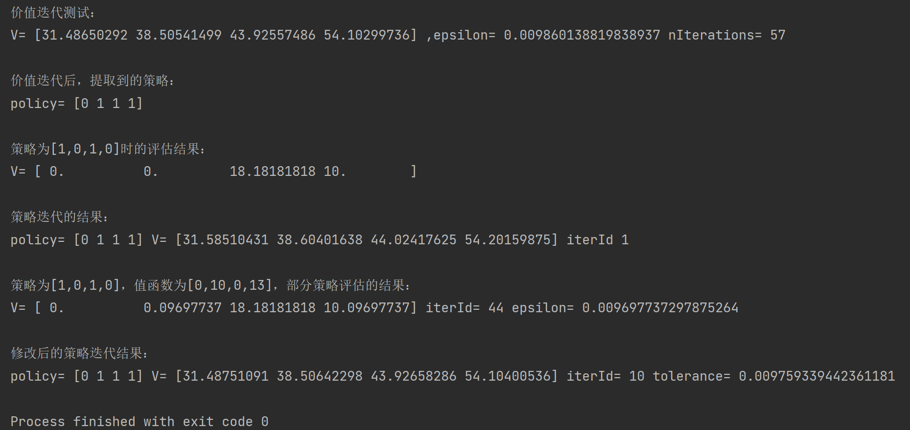
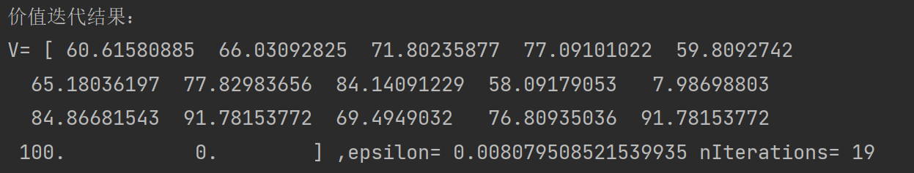
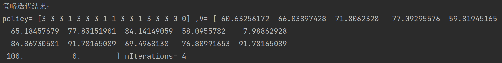

本次作业主要完成强化学习中**值迭代**、**策略迭代**和**修改后的策略迭代**三个任务，共提供MDP.py、TestMDP.py、TestMDPmaze.py三个代码文件。

MDP.py中给出了基础框架，同学们需要在该文件中实现值迭代、策略迭代和修改后的策略迭代，其中：

  **__init__**是构造函数，初始化python类中的变量；

  **valueIteration**是值迭代函数；

  **extractPolicy**是根据状态价值提取策略的函数；

  **evaluetePolicy**是策略评估函数，通过求解线性方程组来实现；

  **policyIteration**是策略迭代函数；

  **evaluatePolicyPartially**是部分的策略评估函数，执行多次值迭代来代替精确评估；

  **modifiedPolicyIteration**是修改后的策略迭代函数，其中调用了 evaluatePolicyPartially函数进行策略评估。

TestMDP.py中给出了各个方法简单的测试程序，测试结果示例如下：

TestMDPmaze.py是代码的详细测试程序，进行如下测试：

  1.参数tolerance=0.01,值函数的所有状态初始化为0，**值迭代**的结果，样例如下所示：

  2.初始策略中所有状态对应动作全为动作0，**策略迭代**的结果，样例如下所示：

  3.参数tolerance=0.01,值函数的所有状态初始化为0，初始策略中所有状态对应动作全为动作0，部分策略评估中迭代次数从1~10，**修改后的策略迭代**的结果。**并且讨论部分策略评估中迭代次数对结果的影响，并将结果与值迭代和策略迭代联系起来**。

**基础环境**：numpy

**硬件要求**：CPU运行即可